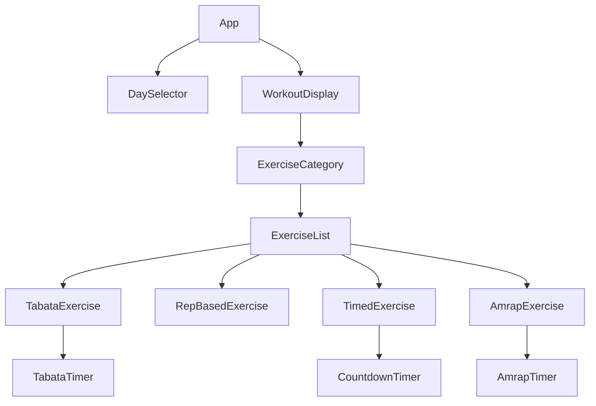
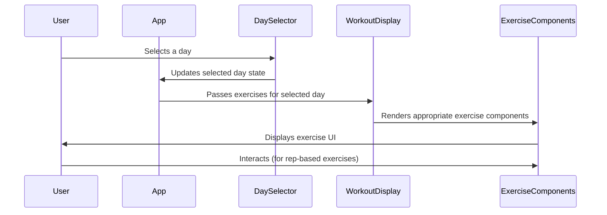

# Fitness Training App Implementation Plan

## Component Architecture



### Component Breakdown

1. **App**: Main component that manages state for selected day
2. **DaySelector**: Displays day buttons and handles day selection
3. **WorkoutDisplay**: Shows exercises for the selected day
4. **ExerciseCategory**: Groups exercises by category (warmUp, strength, core, cardio)
5. **ExerciseList**: Renders a list of exercises for a category
6. **Exercise Components**:
   - **TabataExercise**: For tabata-type exercises with work/rest intervals
   - **RepBasedExercise**: For exercises with sets and reps, allows advancing with Enter key
   - **TimedExercise**: For exercises with a fixed time duration
   - **AmrapExercise**: For AMRAP-type exercises
7. **Timer Components**:
   - **TabataTimer**: Clock display showing work/rest intervals with automatic progression
   - **CountdownTimer**: Simple countdown timer for timed exercises
   - **AmrapTimer**: Timer for AMRAP exercises

## Data Flow



## Implementation Details

### 1. State Management

```typescript
// In App.tsx
const [selectedDay, setSelectedDay] = useState<string | null>(null);
const [currentExercises, setCurrentExercises] = useState<any>(null);

// Update exercises when day is selected
useEffect(() => {
  if (selectedDay) {
    const dayExercises = weeklyWorkoutPlan[selectedDay];
    setCurrentExercises(dayExercises);
  }
}, [selectedDay]);
```

### 2. TabataExercise Component

This component will display a tabata exercise with a timer that automatically alternates between work and rest periods.

```typescript
interface TabataTimerProps {
  workTime: number; // in seconds
  restTime: number; // in seconds
  rounds: number;
}

// TabataTimer will:
// - Display a clock-style timer
// - Automatically alternate between work/rest periods
// - Provide visual indication of current phase (work/rest)
// - Play a sound when transitioning between phases
```

### 3. RepBasedExercise Component

This component will display rep-based exercises and allow the user to advance to the next exercise by pressing Enter.

```typescript
interface RepBasedExerciseProps {
  name: string;
  sets: number;
  reps: number;
  onComplete: () => void;
}

// RepBasedExercise will:
// - Display exercise name, sets, and reps
// - Allow tracking current set
// - Listen for Enter key to advance to next exercise
```

### 4. TimedExercise Component

This component will display timed exercises with a countdown timer.

```typescript
interface TimedExerciseProps {
  name: string;
  time: string; // e.g., "1 min", "30s"
  sets?: number;
}

// TimedExercise will:
// - Display exercise name and time
// - Show a countdown timer
// - Handle multiple sets if specified
```

### 5. AmrapExercise Component

This component will display AMRAP exercises with a timer and the list of exercises to perform.

```typescript
interface AmrapExerciseProps {
  name: string;
  duration: string;
  format: string[];
}

// AmrapExercise will:
// - Display the AMRAP duration
// - Show the list of exercises to perform
// - Provide a timer for the AMRAP duration
```

## UI Design Principles

1. **Minimalist**: Clean, uncluttered interface
2. **High Contrast**: Dark background with bright text for readability
3. **Clear Typography**: Large, readable text for exercise names and instructions
4. **Visual Feedback**: Color changes to indicate active/rest periods
5. **Responsive**: Works well on different screen sizes

## Implementation Plan

1. **Phase 1**: Set up basic component structure and navigation

   - Implement day selection
   - Create basic layout for workout display

2. **Phase 2**: Implement exercise type components

   - Create TabataExercise with timer
   - Implement RepBasedExercise with keyboard input
   - Build TimedExercise with countdown
   - Develop AmrapExercise component

3. **Phase 3**: Refine UI and interactions

   - Improve visual design
   - Add transitions between exercises
   - Implement sound notifications for tabata intervals

4. **Phase 4**: Testing and optimization
   - Test all exercise types
   - Ensure responsive design
   - Optimize performance

## Technical Considerations

1. **Timer Implementation**: Use `setInterval` for timers, but ensure they're properly cleaned up with `useEffect` cleanup functions
2. **Keyboard Events**: Use event listeners for detecting Enter key presses
3. **Parsing Time Formats**: Create utility functions to parse time formats like "1 min", "30s", "20s/10s"
4. **Sound Effects**: Use the Web Audio API for timer sounds
